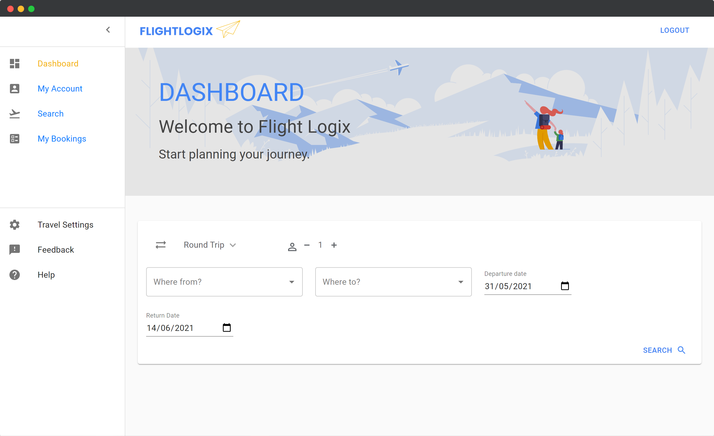

# FLIGHTLOGIX
 
 

    
 

  
RELEASE: V1.0

 
DEVELOPERS: <a href="https://github.com/johansonfelix" targef="_blank" rel="noreferrer">Johanson Felix Kor</a>  & <a href="https://github.com/angoram" targef="_blank" rel="noreferrer">Andrew Kor</a> 

 

 

## Project Overview
FlightLogix is a Flight Booking Web Application that finds the cheapest flights based on a user search and allows the users to make bookings based on the available flights in the search results. The application is split into two control resources: The User Service which controls user registration, login and logout, and the Booking Engine which controls creating, viewing, modifying and canceling bookings. There are two types of users that can access these resources and perform operations: customers and administrators. Customers can search for flights and make a booking from the returned results, modify that booking or cancel. Administrators of the application can view all customers registered in the system and their existing bookings. The administrators can then modify/cancel existing customer bookings or create new bookings for customers. 

### Technical Overview
FlightLogix is developed as a web application using the REST architecture in Java™ with Maven. The REST architecture is implemented with the Jakarta RESTful Web Services API specification (JAX-RS) running in the backend as a service. External Public API service calls are made on this backend service side with Java. The application is built on top of the Open Liberty Java™ server runtime framework. On the client side, requests and front end components are managed and developed with the React JavaScript library.

------------------------------------------------------------------------------------------------------------

## INSTALLATION AND CONFIGURATION

### Requirements:

- A compatible IDE (Intellij, eclipse)
- Maven installed, with "mvn" in PATH
- Github account, with repo access
- npm (Node package manager) installed

### STEPS:

- Clone the repository from github.com/johansonfelix/flightlogix

### SERVER SIDE CONFIG:

- Open a terminal, and go to the path: ~/FlightLogix
- Enter the command: "mvn liberty:dev"
The server should take ~ 2 minutes to start running. You should see a couple of links to the server when it's done.
- You can now make requests to the server.

### FRONT-END SIDE CONFIG:

- Open a terminal, and go to the path: ~/FlightLogix/front-end
- Run "npm install" to install the required packages. If need be, run "npm audit fix" to fix any errors
in the packages.
- Once packages are installed, you can run the front-end side by using the command "npm start"
- You should now see a react webpage. You can't make requests yet, because you need to add the SSL certificate.
- On your browser, go to Manage SSL Certificates and import the key.12 file located at:
~\FlightLogix\target\liberty\wlp\usr\servers\defaultServer\resources\security\key.p12
As "Trusted root authority"
- You can now make requests to the server from the front-end!

## Usages
<h3> User Login Page </h3>

<h3> User Dashboard </h3>

<h3> Admin Dashboard </h3>

<h3>Flight Search </h3>

<h3>Flight Search Results </h3>

<h3>Flight Details </h3>

<h3>Purchase Simulation Portal </h3>

